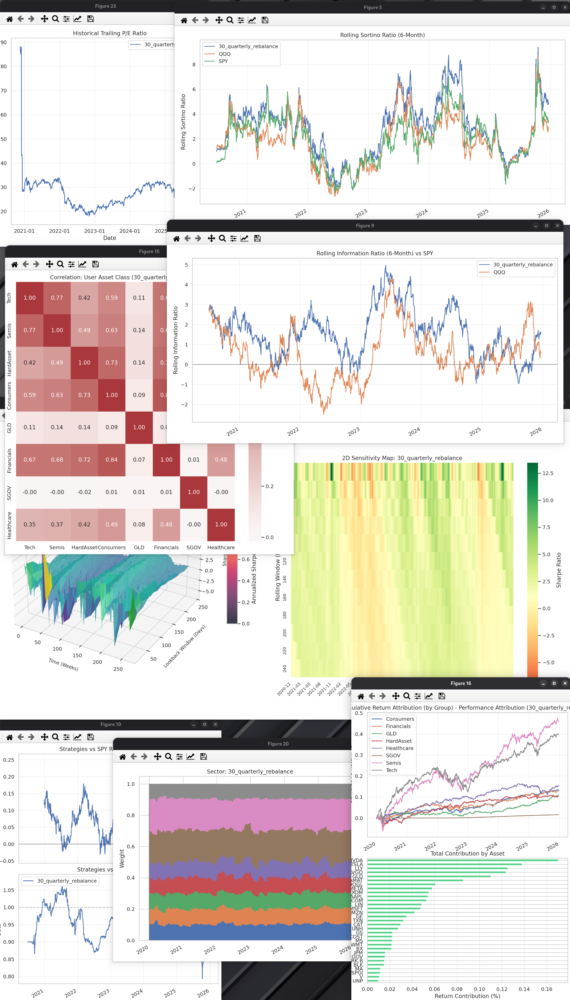
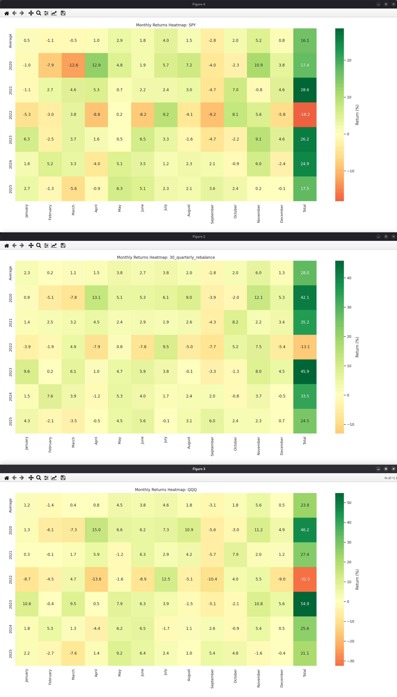

# Institutional Backtester

A powerful, Python-based backtesting engine designed for institutional-grade financial analysis. This tool allows for multi-strategy backtesting, risk attribution, and advanced visualizations, including 3D parameter robustness surfaces and interactive financial charts.

## Key Features

### 🚀 Core Engine
- **Multi-Strategy Support**: Run multiple portfolios and benchmarks simultaneously using YAML configurations.
- **Flexible Rebalancing**: Support for daily, weekly, monthly, quarterly, and yearly rebalancing frequencies.
- **CLI Overrides**: Easily override start/end dates, benchmarks, and risk-free rates from the command line.

### 📊 Data & Fundamentals
- **Hybrid Data Sourcing**: Fetches historical data from Alpaca (primary) and yfinance (fallback).
- **Intelligent Caching**: Local CSV-based caching with gap-filling logic to minimize API calls.
- **Fundamental Analysis**: Integration with SimFin for historical TTM EPS and weighted harmonic mean Portfolio P/E trends.

### 📈 Advanced Visualizations
- **Interactive Charts**: All legends are interactive (toggle visibility), and a cross-hair cursor provides real-time data inspection.
- **Graph Selection GUI**: A Tkinter-based interface to select exactly which graphs to render, preventing window clutter.
- **Risk & Performance Attribution**:
    - Marginal Contribution to Risk (MCTR) by asset or group.
    - Cumulative Return Attribution.
    - Individual and Grouped Correlation Matrices.
- **Regime Analysis**: Upside and Downside Capture ratios relative to benchmarks.
- **Robustness Testing**:
    - **3D Sharpe Robustness Surface**: Identify "parameter islands" and overfit strategies.
    - **3D Drawdown-Recovery Surface**: Visualize the asymmetry of loss and recovery time.
- **Enhanced Heatmaps**: Monthly returns heatmap with monthly averages and compounded yearly totals.

## Installation

1. **Clone the repository**:
   ```bash
   git clone <repository-url>
   cd backtest
   ```

2. **Set up a virtual environment**:
   ```bash
   python3 -m venv venv
   source venv/bin/activate
   ```

3. **Install dependencies**:
   ```bash
   pip install -r requirements.txt
   ```

4. **Environment Variables**:
   Create a `.env` file or export the following:
   ```bash
   export SIMFIN_API_KEY='your_simfin_key'
   export ALPACA_API_KEY='your_alpaca_key'
   export ALPACA_SECRET_KEY='your_alpaca_secret'
   ```
   Note that you don't really need the APIs as long as they are covered in the datasets. I've pushed the datasets that I'm using in the backtesting so you can just run that as an demo.

## Usage

Run a backtest using a configuration file:
```bash
python main.py portfolios/30_quarterly_rebalance.yaml --start_date "2020-01-01" --benchmarks SPY,QQQ
```

### CLI Arguments
- `configs`: Path(s) to YAML configuration files.
- `--start_date`: Start date (YYYY-MM-DD).
- `--end_date`: End date (YYYY-MM-DD).
- `--benchmarks`: Comma-delimited list of benchmark tickers.
- `--rf`: Risk-free rate (e.g., 0.04 for 4%).
- `--no-graph`: Run backtest without rendering visualizations.

## Configuration

Strategies are defined in YAML. Example:
```yaml
settings:
  rebalance_frequency: quarterly
  benchmarks: [SPY, QQQ]
  risk_free_rate: 0.04

portfolio:
  fixed_weights:
    AAPL: 0.2
    MSFT: 0.2
  universe:
    Tech: [NVDA, AMD, INTC]
    Finance: [JPM, GS, MS]
  sector_weights:
    Tech: 0.3
    Finance: 0.3
```

## Data Visualization

> **NOTE**
>
> Graphs work on Mac. Very janky on Linux Gnome with PyQt5. Haven't tested it on Windows.





## Architecture

- `main.py`: CLI entry point.
- `engine.py`: Orchestrates data fetching, backtest execution, and plotting.
- `data.py`: Handles historical price data and metadata with caching.
- `analytics.py`: Professional risk and performance metric calculations.
- `visualization.py`: Extensive suite of 2D and 3D plotting functions.
- `fundamentals.py`: Processes historical fundamental data.
- `gui.py`: Tkinter-based graph selection interface.

## License
MIT
